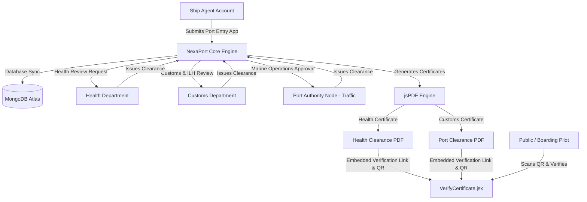

# Software Requirements Specification (SRS)
## NexaPort - Port Management System (National Maritime Single Window Portal)
### New Mangalore Port Authority (NMPA) — Govt. of India Enterprise

---

## 2.1. Introduction

### 2.1.1. Purpose
This Software Requirements Specification (SRS) document defines the comprehensive software, operational, and security requirements for **NexaPort (National Maritime Single Window Portal)**. Designed specifically for the **New Mangalore Port Authority (NMPA)**, this system digitizes, centralizes, and automates the multi-department clearance workflow required for vessels arriving at and departing from New Mangalore Port.

### 2.1.2. Scope
The NexaPort platform is a web-based, role-restricted Single Window Portal that serves as a shared environment for Ship Agents, Port Authorities, Customs Officers, and Port Health Officers. The system manages:
1. **User Authentication & Administration**: Multi-factor authentication, administrative approvals, and account provisioning.
2. **Vessel Registry**: Detailed registration database of commercial vessels.
3. **Port Entry & Clearance Workflows**: Consolidated multi-department application, document upload, and evaluation pipelines.
4. **Certificate Generation & Verification**: High-fidelity, bilingual, dynamically generated PDF certificates featuring active cryptographic verification QR codes.
5. **Logs & Security Audits**: Non-repudiation tracking through system audit trails and operational log exports.

### 2.1.3. Definitions, Acronyms, and Abbreviations

| Abbreviation / Term | Definition |
| :--- | :--- |
| **NMPA** | New Mangalore Port Authority |
| **SRS** | Software Requirements Specification |
| **SPA** | Single-Page Application |
| **ETA / ETD** | Estimated Time of Arrival / Estimated Time of Departure |
| **ILH** | Indian Light House (Dues paid by ship owners for lighthouse upkeep) |
| **PHO** | Port Health Organisation / Port Health Officer |
| **2FA / TOTP** | Two-Factor Authentication / Time-Based One-Time Password |
| **IGM / EGM** | Import General Manifest / Export General Manifest |
| **MERN** | MongoDB, Express, React, Node.js Tech Stack |
| **JWT** | JSON Web Token |

### 2.1.4. References
* *Indian Port Health Rules, 1955* (Ministry of Health & Family Welfare, Govt. of India).
* *International Health Regulations (IHR), 2005* (World Health Organization).
* *The Customs Act, 1962* (Ministry of Finance, Govt. of India).
* NexaPort codebase repository files: [`App.jsx`](file:///D:/Download/Port_Management_Website/frontend/src/App.jsx), [`ClearanceWorkflow.jsx`](file:///D:/Download/Port_Management_Website/frontend/src/ClearanceWorkflow.jsx), [`AuthContext.jsx`](file:///D:/Download/Port_Management_Website/frontend/src/AuthContext.jsx).

---

## 2.2. Overall Description

### 2.2.1. Product Perspective
NexaPort functions as an independent, secure National Maritime Single Window portal that connects local port agents with three major Government of India entities: the **Port Health Organisation**, the **Central Board of Indirect Taxes and Customs (CBIC)**, and the **New Mangalore Port Authority (NMPA) Traffic Control**. 



### 2.2.2. Product Functions
The primary features of the NexaPort System are:
* **Government Identity & Accessibility System**: Integrating the official tricolor banner theme, Hindi/English bilingual UI, and dynamic font scale controls (A+, A, A-).
* **Two-Factor Authenticated User Console**: Registration with mandatory administrator approval, bcrypt password hashing, and TOTP setup with Google Authenticator (QR code generator).
* **Vessel Registry Management**: Inputting and maintaining structural dimensions (Gross Registered Tonnage, Net Registered Tonnage), IMO numbers, flag states, and ownership details.
* **Consolidated Clearance Hub**: Ship agents file single applications detailing captain credentials, arrival/departure timelines, crew and passenger statistics, cargo categories, and ILH receipt details (receipt numbers, paid amounts, validity limits).
* **Cross-Department Clearance Stepper**: A sequential routing mechanism (Health $\rightarrow$ Customs $\rightarrow$ Traffic Control) tracking approval statuses, reviewer notes, and clearances.
* **Authentic Certificate Generation**: Dynamic rendering of certificates with simulated stamp styles, bilingual headers, and digital signature stamps.
* **Public Certificate Verification Portal**: A routing structure enabling external inspectors and boarding pilots to immediately verify certificates by scanning their QR codes.
* **Operational Logs & Audit Trail Console**: A query interface monitoring user actions (logins, creations, status transitions) for security compliance.

### 2.2.3. User Characteristics
1. **System Administrator**: Oversees user provisioning, reviews registration requests, configures 2FA keys, and audits logs. High technical expertise.
2. **Ship Agent Account**: Enrolls vessels in the registry and files entry applications on behalf of shipping lines. Moderate technical expertise.
3. **Health Department (PHO)**: Port Health Officers verifying health logs, sanitization lists, and issuing health certificates. Basic to moderate technical expertise.
4. **Customs Department**: Customs Officers checking cargo manifests, manifest declarations, and ILH payments to issue port clearance. Basic to moderate technical expertise.
5. **Port Authority Node (Traffic Control)**: Traffic directors managing berth availability, piloting logs, and issuing the final permission to dock/sail. Basic to moderate technical expertise.

### 2.2.4. General Constraints
* **Session Inactivity Timeout**: The system forces a logout if no activity is detected for 60 seconds to secure shared work terminals.
* **Technical Framework Limits**: Designed as a Single Page Application using Vite + React. Standard styles are managed through optimized vanilla CSS.
* **Audit Trails Compliance**: Under Indian cybersecurity laws, all security actions must be recorded on a MongoDB backend without any deletion APIs exposed to clients.
* **Language Support**: All static resources and database status descriptors must support English-to-Hindi mapping.

### 2.2.5. Assumptions
* Users have mobile devices to run standard TOTP authenticators.
* Port authorities have active internet access to query the MongoDB backend.
* Active QR codes pointing to verification URLs rely on client browser availability.

---

## 2.3. Special Requirements

### 2.3.1. Language & Accessibility
* **Bilingual Translation Support**: Global translation mapper in [`AuthContext.jsx`](file:///D:/Download/Port_Management_Website/frontend/src/AuthContext.jsx) maps UI labels in both English and Hindi.
* **Font-Size Adjustments**: Root CSS mapping dynamically shifts sizes between 14px (A-), 16px (A), and 18px (A+) without breaking layout columns.

### 2.3.2. Official Branding Guidelines
* **Tricolor Stripe Banner**: Header must reflect the official colors: Saffron (#FF9933), White (#FFFFFF), and Green (#138808) with the text "भारत सरकार | GOVERNMENT OF INDIA" and "सत्यमेव जयते".
* **Theme Switching**: Flexible dark-mode override via root CSS (`data-theme="dark"`).

---

## 2.4. Functional Requirements

### 2.4.1. Module 1: User Authentication & Administration
* **FR-1.1**: Users can register with a username, password, email, and role selection.
* **FR-1.2**: All new registrations must be initialized in a `pending` state, preventing access until approved by an administrator.
* **FR-1.3**: Administrators can view a user roster, approve pending registrations, reject them, or toggle 2FA configurations.
* **FR-1.4**: On registration, the system generates a random 16-character Base32 string and a QR code pointing to a Google Authenticator URL schema (`otpauth://totp/...`).
* **FR-1.5**: Upon login with valid credentials, if 2FA is active, the system requires a 6-digit TOTP input before returning a JWT.
* **FR-1.6**: Background threads monitor user movements and trigger an automatic logout alert after 60 seconds of zero interaction.

### 2.4.2. Module 2: Vessel Registry
* **FR-2.1**: Ship Agents can record new vessels, supplying the vessel's name, IMO number, flag state, vessel type, ownership details, GRT, and NRT.
* **FR-2.2**: The backend validates IMO uniqueness, ensuring duplicate registries do not occur.
* **FR-2.3**: Vessels registered by an agent are bound to their user ID, allowing agents to select only their verified ships during journey submissions.

### 2.4.3. Module 3: Clearance Workflow Hub
* **FR-3.1**: Ship Agents submit a voyage entry application, linking it to a registered vessel. Additional required fields are:
  - Last Port of Origin & Destination Port
  - ETA and ETD timestamps
  - Commander/Captain Name
  - Cargo Category (Ballast, Crude Oil, Container Cargo, General Cargo, LNG, LPG)
  - Crew Count and Passenger Count
  - ILH Receipt details (Receipt Number, Paid Date, Amount in INR, Valid From/To)
  - Base64 encoded file attachments (IGM, Health Declaration, Cargo Manifests)
* **FR-3.2**: A multi-department evaluation board displays clearances across three distinct columns: Health Department, Customs Department, and Port Traffic Control.
* **FR-3.3**: Department users see applications pending their review. When editing an application, they submit an approval status (`Approved`/`Rejected`) along with a mandatory review note.
* **FR-3.4**: When all three departments (Health, Customs, Traffic) mark an application as Approved, the journey's global status transitions to `Cleared`. If any department rejects the application, the global status transitions to `Rejected`.

### 2.4.4. Module 4: Certificate Generation & Verification
* **FR-4.1**: The system dynamically generates official PDF files using client-side jsPDF rendering.
* **FR-4.2**: **Certificate of Health Clearance**:
  - Green background theme with double border lines.
  - Contains PHO headers, bilingual texts, Indian emblem, and Port Health Officer signature block.
  - Features an active verification QR code linking to the verification endpoint.
* **FR-4.3**: **Port Clearance Certificate**:
  - Valid for 72 hours.
  - Features CBIC/Customs Header in English and Hindi, official logo, and Certificate Number/Date.
  - Details cargo type, crew size, GRT/NRT, and ILH dues validation.
  - Shows a digital signature box for the Assistant Commissioner of Customs.
* **FR-4.4**: The verification portal is a publicly accessible route (`#/verify-certificate/:journeyId`) that does not require login. It fetches the journey details from the backend and confirms the validity of the certificate in real time.

### 2.4.5. Module 5: Audit Logs & System Trails
* **FR-5.1**: Every user transaction (login, user registration, vessel addition, journey update, department approval) must append a permanent entry to the audit logs collection.
* **FR-5.2**: Administrators and Port Authorities can query, filter, search, and export the audit database.

---

## 2.5. Design Constraints

### 2.5.1. Front-end Architecture
* Built as a React SPA with **Vite** development server mapping.
* Utilizes **React Router DOM** with `HashRouter` to prevent server-side fallback issues during static deployment.
* Standardized component styling built with vanilla CSS featuring high-performance glassmorphism gradients and variable declarations.
* Icon sets rendered via SVG using **Lucide React**.

### 2.5.2. Back-end Architecture
* Run on **Node.js** using the **Express** framework.
* Connection to **MongoDB Atlas** database via **Mongoose ORM**.
* State validation, cryptographical signing, and auth tokens managed via **bcryptjs** and **jsonwebtoken**.
* Two-factor generator checks handled securely in the backend route via `totp-generator`.

---

## 2.6. System Attributes

### 2.6.1. Security
* **2FA Enforcement**: Mandatory TOTP security verification prevents identity theft on accounts.
* **JWT Authentication**: Secure REST endpoints verified using HTTP Bearer headers.
* **Password Hashing**: Bcrypt salt generation rounds set to 10.
* **Auto-Logout Security**: Automatic 60-second inactivity session cleanup.

### 2.6.2. Reliability & Availability
* **Health Route Check**: `/health` endpoint exposes DB connectivity state to service managers.
* **Background Sync Checking**: The client runs a background polling daemon (every 6 seconds for changes and 5 seconds for workflow lists) to maintain synchronization with MongoDB.

### 2.6.3. Usability
* Responsive design grid accommodates standard tablet screens and desktop monitors.
* Supports accessibility font sizing and a low-glare dark mode option.

---

## 2.7. Other Requirements

### 2.7.1. Database Schema Specifications

```javascript
// User Schema
const UserSchema = new mongoose.Schema({
    username: { type: String, required: true, unique: true },
    password: { type: String, required: true },
    email: { type: String, required: true },
    role: { type: String, required: true, enum: ['System Administrator', 'Ship Agent Account', 'Port Authority Node', 'Customs Department', 'Health Department'] },
    status: { type: String, required: true, enum: ['pending', 'approved', 'rejected'], default: 'pending' },
    twoFactorSecret: { type: String },
    is2FAEnabled: { type: Boolean, default: true }
});

// Vessel Schema
const VesselSchema = new mongoose.Schema({
    name: { type: String, required: true },
    imoNumber: { type: String, required: true },
    flagState: { type: String, required: true },
    vesselType: { type: String, required: true },
    ownerDetails: { type: String, required: true },
    grt: { type: Number, required: false },
    nrt: { type: Number, required: false },
    userId: { type: String, required: false }
});

// Journey Schema
const JourneySchema = new mongoose.Schema({
    vessel: { type: Object, required: true },
    lastPortOfCall: { type: String, required: true },
    eta: { type: Date, required: true },
    etd: { type: Date, required: true },
    status: { type: String, default: 'In Progress' },
    clearances: {
        customs: { type: String, default: 'Pending' },
        health: { type: String, default: 'Pending' },
        traffic: { type: String, default: 'Pending' }
    },
    notes: {
        customs: { type: String, default: '' },
        health: { type: String, default: '' },
        traffic: { type: String, default: '' }
    },
    documents: [{ type: String }],
    captainName: { type: String, default: '' },
    destinationPort: { type: String, default: '' },
    cargoType: { type: String, default: 'BALLAST' },
    crewCount: { type: Number, default: 0 },
    passengerCount: { type: Number, default: 0 },
    ilhReceiptNo: { type: String, default: '' },
    ilhPaidDate: { type: Date },
    ilhAmount: { type: Number, default: 0 },
    ilhValidFrom: { type: Date },
    ilhValidTo: { type: Date },
    healthCertificateNo: { type: String, default: '' },
    healthClearanceDate: { type: Date },
    portClearanceNo: { type: String, default: '' },
    portClearanceDate: { type: Date },
    userId: { type: String, required: false }
});

// Audit Trail Schema
const AuditTrailSchema = new mongoose.Schema({
    timestamp: { type: Date, default: Date.now },
    user: { type: String, required: true },
    action: { type: String, required: true }
});
```

### 2.7.2. Deployment
* Front-end: Static distribution build optimized via `vite build`, served through the backend server as static middleware.
* Back-end: Run using environment variables configuring `PORT`, `JWT_SECRET`, and `MONGODB_URI`.
